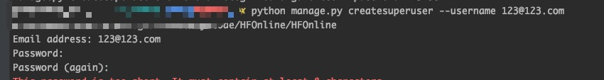

# HFOnline

## 示例

### hfonline 启动，效果如下 gif 

### 登录「管理员」页面：

1. 运行命令
<pre>
python manage.py createsuperuser --username 123@123.com --password 123456
</pre>

2. 运行命令后，出现如下提示

3. 输入邮箱密码，输入成功后登录：http://127.0.0.1:8000/xadmin/ ，效果如下 gif 

### 「管理员管理列表」效果如下

## 感谢
[Django](https://github.com/django/django)
